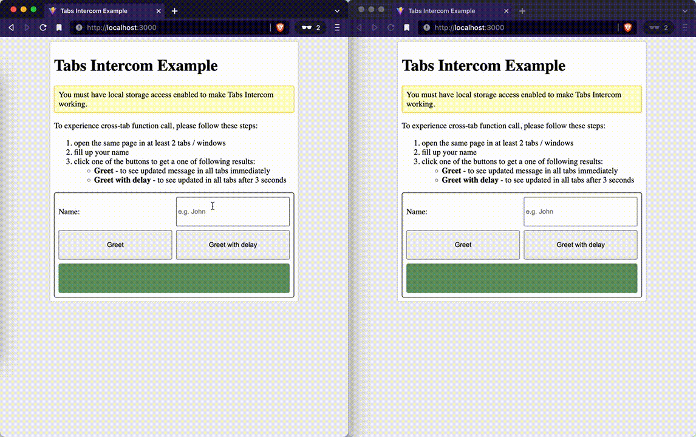

# Tabs Intercom

Call a function with params across multiple browser tabs.
Forget about emitting and listening to events — just register a function and call as usual function!



[Demo](https://pawel-schmidt.github.io/tabs-intercom/)

## Installation

```shell
# npm
npm install @simplemented/tabs-intercom

# yarn
yarn add @simplemented/tabs-intercom

# pnpm
pnpm add @simplemented/tabs-intercom
```

## Usage

> Before using, please read the docs carefully, especially [Caveats](#caveats) section.

```typescript
// 0. Import `TabsIntercom`
import TabsIntercom from '@simplemented/tabs-intercom'

// 1. Define a function
function greet(name: string) {
  alert(`Hello, ${name}!`)
}

// 2. Create an instance of `TabsIntercom`
const tabsIntercom = new TabsIntercom()

// 3. Register function
const greetEverywhere = tabsIntercom.register(greet)

// 4. Call returned function wherever you want
greetEverywhere(prompt())
greetButton.addEventListener('click', () => greetEverywhere(nameInput.value))

// 🎉 Voila! The function is called in all tabs 🎉

// (Optionally) 5. Unregister function if no longer needed
tabsIntercom.unregister('greet')
```

## Caveats

1. Registered function name must be unique

   ```typescript
   function greet() { /* … */ }
   tabsIntercom.register(greet)

   // ❌ wrong
   tabsIntercom.register(greet)
   // ✅ correct
   tabsIntercom.register(greet, 'greetings')
   ```

1. Registered function name must be present

   ```typescript
   const smile = () => ':-)'

   // ❌ wrong
   tabsIntercom.register(smile)
   // ✅ correct
   tabsIntercom.register(smile, 'smile')
   tabsIntercom.register(smile, 'any name, actually')

   // ❌ wrong
   tabsIntercom.register(function() { /* … */ })
   // ✅ correct
   tabsIntercom.register(
     function() { /* … */ },
     'same as in case of arrow function ☝️'
   )
   ```
   
   Please notice that functions defined with `function` keyword have defined `name` property by default.

   ```typescript
   const smile = () => ':-)'
   smile.name = 'smiley'
   // ✅ correct
   tabsIntercom.register(smile)
   ```

1. Registered function can only take serializable parameters

   ```typescript
   function doMagic(
     callback: () => void,
     // any other non-fully-serialiable object
   ) { /* … */ }
   const doMagicEverywhere = tabsIntercom.register(doMagic)
   // ❌ wrong
   doMagicEverywhere(() => alert('🪄'))
   
   function doStuff(
     b: boolean,
     n: number,
     s: string,
     o: object,
     // any other serializable object
   ) { /* … */ }

   const doStuffEverywhere = tabsIntercom.register(doStuff)
   // ✅ correct
   doStuffEverywhere(true, 42, 'hi', { name: 'John' })
   ```

## Development

```bash
pnpm start # or yarn start
```

This builds to `/dist` and runs the project in watch mode so any edits you save inside `src` causes a rebuild to `/dist`.

To do a one-off build, use `pnpm build` or `yarn build`.

To run tests, use `pnpm test` or `yarn test`.

## License

[MIT License](https://github.com/pawel-schmidt/tabs-intercom/blob/main/LICENSE)

Copyright © 2022, [simplemented.com](https://simplemented.com)